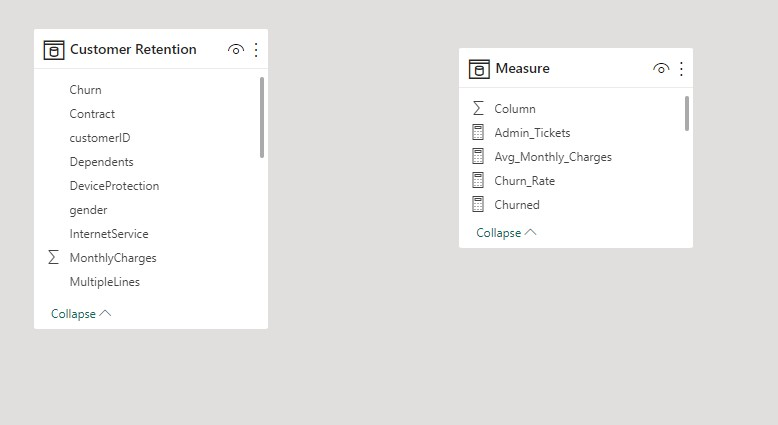
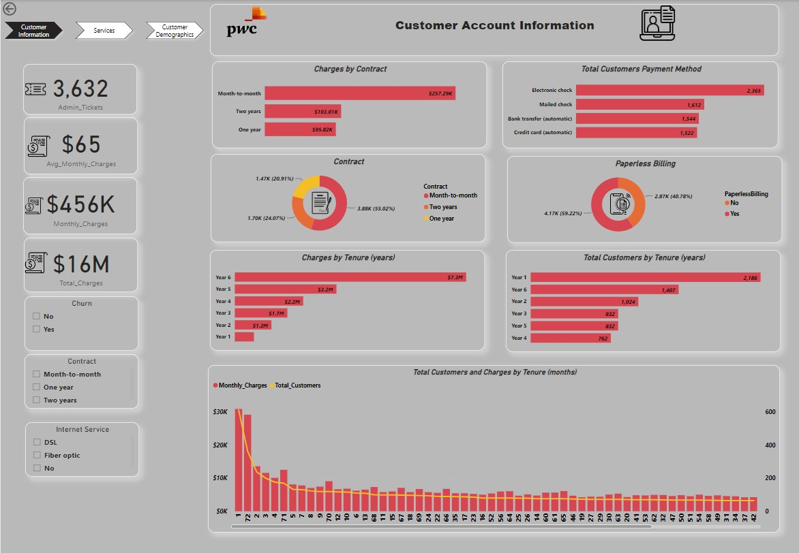
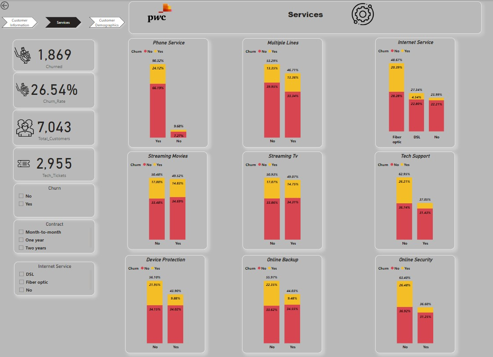
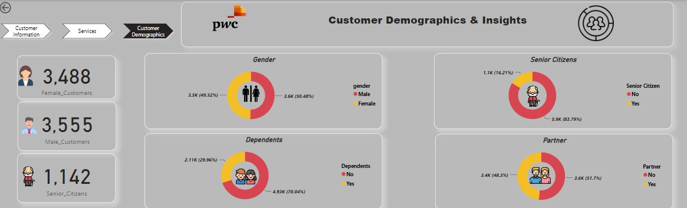

# Pwc-Switzerland-Analysis

## Introduction

This analysis was carried out using Power BI. The dataset was from forage to help answer some Business case scenarios and it was a virtual case study for Pwc Switzerland to test your understanding of real life cases.

## Problem Statement

The aim of this analysis is to answer the following Business related questions

- What Contract type had the highest charges?
- What payment method was mostly used by customers?
- What tenure had the highest number of customers?
- What tenure had the highest charges?
- What was the average monthly charge to customers?
- Out of the total customers, how many churned & what was the overall churn rate?
- Show the churn rates of the range of services provided by the business?
- Out of the total customers, how many were males & females?
- How many senior citizens were among the customers?

## Skills & Concept used:

- Dax 
- Analytical thinking
- Page navigation
- Calculated column using IF/Else function
- Visual design ((Using appropriate visuals to send appropriate message to stakeholders)

## Data Source:

A simple Excel file was provided for this analysis.

## Data Transformation/Cleaning/Manipulation:

The data did not have nulls and incomplete rows, so I created different measures and created calculated columns (If/else statements) & aggregate functions.

## Data Modelling:

Only 1 fact table was provided which was sufficient for the analysis. I created another table where I kept all my DAX measures. No dimension table was provided hence, no need for any connection.

## Data Visualization:

3 tabs were used for the different visuals. customer, services & customer demographics.

